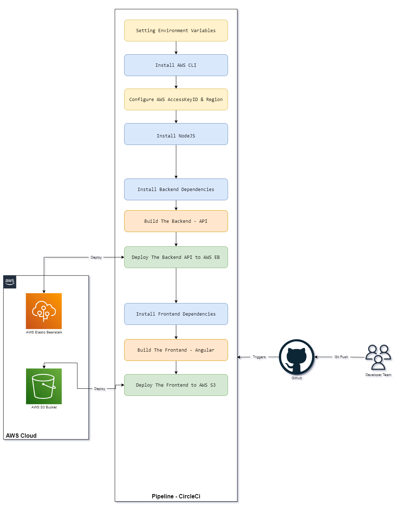

## Udagram CircleCI CI/CD

- many developers will commit and push new code to the GitHub repo which will trigger a circleCI pipeline
- circle CI will deploy the code for frontend on S3 bucket and for the server on EBS